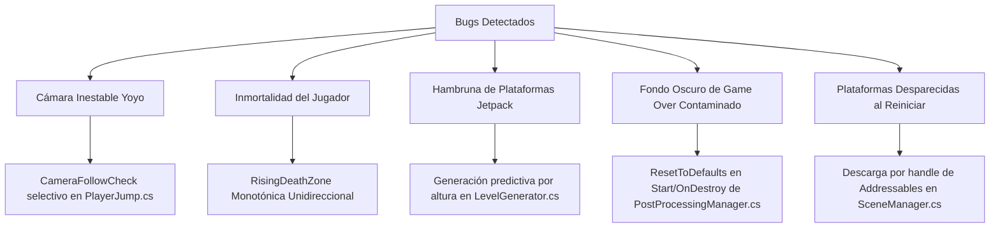

# 📑 Documentación Técnica de Cambios y Optimizaciones — Lumens-Jump

Este documento centraliza todas las modificaciones, diagnósticos de fallos y mejoras arquitectónicas implementadas en el proyecto **Lumens-Jump**. Estas intervenciones estabilizan el ciclo de juego, optimizan el flujo de cámara, resuelven bugs críticos de jugabilidad y potencian la experiencia de usuario (sensación de recompensa y dopamina).

---

## 🛠️ Resumen de Cambios Clave

A continuación se detallan las 6 intervenciones fundamentales realizadas en el codebase de Unity:



---

## 1. 🎥 Corrección del Efecto "Yoyo" en la Cámara
* **Script Afectado:** `Assets/Systems/Player/PlayerJump.cs`
* **Tipo de Cambio:** Optimización de Comportamiento y Estructuración de Jerarquía.

### 🔍 Diagnóstico (El Problema)
El componente Cinemachine seguía al transform del jugador de forma incondicional en el eje vertical (Y). Cuando el jugador caía o realizaba descensos rápidos, la cámara bajaba de golpe con él. Esto generaba un efecto "yoyo" visualmente inestable, además de permitir al jugador ver zonas inferiores obsoletas que debieron haber sido destruidas.

### 🛠️ Solución Implementada
Rediseñamos el flujo de seguimiento de la cámara dividiéndolo en dos capas lógicas en el método `CameraFollowCheck()`:

1. **Ascenso Autónomo del Bounds (`cameraBounds`):**
   Creamos un objeto físico intermedio que sube de forma constante y autónoma calculando la velocidad de la zona de muerte:
   $$\text{risingSpeed} = \text{risingDeathZone.CurrentSpeed} + \text{cameraSpeedOffset}$$
   Si el jugador salta y supera esta altura autónoma, arrastra el límite (`_cameraBoundsY`) hacia arriba de manera permanente. **El límite nunca desciende**.
2. **Seguimiento Selectivo de Cinemachine:**
   La cámara solo sigue al transform del jugador bajo dos condiciones estrictas:
   * El jugador se desplaza verticalmente hacia arriba (`_rb.linearVelocity.y >= 0`).
   * El jugador se encuentra físicamente por encima del límite autónomo (`transform.position.y >= _cameraBoundsY - 0.5f`).
   
   Si el jugador desciende, la referencia de seguimiento se desvincula (`playerCamera.Follow = null`), manteniendo la cámara estática arriba. Esto permite que el jugador caiga al vacío, salga de la pantalla y muera correctamente.

---

## 2. 💀 Solución al Bug de Inmortalidad (DeathZone Unidireccional)
* **Script Afectado:** `Assets/Systems/Level/RisingDeathZone.cs`
* **Tipo de Cambio:** Corrección de Lógica Física.

### 🔍 Diagnóstico (El Problema)
El jugador era inmortal porque la zona de muerte (`DeathZone`) calculaba su límite superior basándose estrictamente en la posición actual del jugador en cada frame:
```csharp
float maxY = playerTransform.position.y - maxDistanceBelowPlayer;
if (transform.position.y > maxY) { ... }
```
Si el jugador caía al vacío, `maxY` descendía inmediatamente. Esto forzaba a la `DeathZone` y a su hijo (el destructor de plataformas `PlatformDestroyer`) a bajar junto con el jugador, persiguiéndolo y actuando como una red de seguridad. El jugador nunca tocaba el colisionador de muerte y las plataformas antiguas de abajo no se destruían, lo que le permitía rebotar indefinidamente.

### 🛠️ Solución Implementada
Implementamos un sistema de **Ascenso Monotónico Unidireccional** con tres capas de lógica robusta en `RisingDeathZone.cs`:

1. **Límite de Rezago (`maxDistanceBelowPlayer`):** Si el jugador asciende muy alto, la DeathZone es arrastrada hacia arriba para mantener limpio el escenario antiguo.
2. **Límite de Seguridad (`safetyDistance`):** Evita que la zona de muerte suba demasiado rápido y asfixie injustamente al jugador.
3. **REGLA DE ORO (Sin Descensos):** Evaluamos la nueva posición tentativa (`targetY`). Si esta es menor que la posición actual del Transform, el movimiento se ignora:
   ```csharp
   if (targetY > transform.position.y)
   {
       transform.position = new Vector3(transform.position.x, targetY, transform.position.z);
   }
   ```
Ahora, si el jugador cae, la `DeathZone` y el destructor de plataformas permanecen **congelados** en su punto más alto. El jugador colisiona inmediatamente con el trigger de muerte y finaliza la partida.

---

## 3. 🚀 Generación Dinámica de Plataformas (Jetpack / Rocket Starvation)
* **Script Afectado:** `Assets/Systems/Level/LevelGenerator.cs`
* **Tipo de Cambio:** Escalabilidad del Generador del Mundo.

### 🔍 Diagnóstico (El Problema)
Originalmente, el `LevelGenerator` solo generaba una plataforma nueva cuando se disparaba el evento `onPlatformUsed` (al colisionar al caer sobre una plataforma).
Cuando el jugador recolectaba un Power-up como el **Jetpack o Cohete**, salía disparado hacia arriba a gran velocidad sin colisionar con ninguna plataforma intermedia. Al no tocar nada, el generador no creaba nuevas plataformas arriba. Al terminarse el efecto del Jetpack, el jugador llegaba a un vacío absoluto del mapa y caía al abismo inevitablemente.

### 🛠️ Solución Implementada
Migramos el generador a un sistema predictivo basado en la altura en tiempo real dentro del método `Update()`:

* **Búfer de Generación Adelantada:** El sistema calcula constantemente un horizonte de seguridad por encima del jugador:
  $$\text{lookaheadDistance} = (\text{initialSpawnCount} + 2) * \text{spawnYInterval}$$
* **Bucle Predictivo:** Mientras el punto de spawneo de la siguiente plataforma (`_nextSpawnY`) esté por debajo de este horizonte, el script creará plataformas y power-ups de forma inmediata:
  ```csharp
  while (_nextSpawnY < playerTransform.position.y + lookaheadDistance)
  {
      Spawn();
  }
  ```
* **Preservación de la Dopamina:** Las plataformas generadas de forma masiva frente al jugador conservan sus triggers de colisión. Al atravesarlas rápidamente durante el vuelo del Jetpack, el jugador activa ráfagas consecutivas de puntos y efectos de audio, lo que incrementa sustancialmente la satisfacción del gameplay sin romper el flujo de generación.

---

## 4. 🎨 Gestión del Post-Procesamiento en Game Over
* **Scripts Afectados:** `Assets/Systems/Manager/PostProcessingManager.cs` y `Assets/Systems/Player/PlayerDeath.cs`
* **Tipo de Cambio:** Corrección de Flujo y Limpieza de Recursos en Memoria.

### 🔍 Diagnóstico (El Problema)
El juego mantenía estéticamente activa la escena de juego por debajo de la pantalla de GameOver, tiñéndose de color rojo dramático. Sin embargo:
1. Al reiniciar la partida presionando **Play Again**, el post-procesamiento rojo/oscuro persistía, haciendo que el juego se viera permanentemente oscuro u opaco.
2. Si se intentaba limpiar el post-procesamiento inmediatamente en el script de muerte, se arruinaba la transición dramática roja deseada para el lore del Game Over.

### 🛠️ Solución Implementada
Implementamos un ciclo de auto-limpieza basado en los ciclos de vida de Unity en `PostProcessingManager.cs`:

* **Método `ResetToDefaults()`:** Restaura de forma inmediata los valores iniciales de intensidad de la viñeta, aberración cromática y filtro de color de la escena.
* **Auto-limpieza en Ciclo de Vida:**
  * **Al iniciar la escena (`Start`):** Garantiza que cualquier valor residual en el Volume Profile se limpie, arrancando la partida en un estado brillante y claro.
  * **Al descargar la escena (`OnDestroy`):** Cuando la escena de juego antigua es destruida para dar paso a la nueva, los valores del perfil global se resetean, evitando que se contamine el asset físico en disco.
* **Persistencia en Muerte:** `PlayerDeath.cs` conserva la aplicación del color rojo en la transición de muerte. Al presionar reiniciar, la vieja escena se destruye (gatillando `OnDestroy`) y la nueva se inicializa (gatillando `Start`), lo que limpia de forma imperceptible y limpia el post-procesamiento.

---

## 5. 🔁 Corrección de Plataformas Faltantes al Reiniciar (Unload por Handles)
* **Script Afectado:** `Assets/Systems/Manager/SceneManager.cs`
* **Tipo de Cambio:** Gestión de Escenas y Ciclo de Vida de Addressables.

### 🔍 Diagnóstico (El Problema)
Cuando el jugador presionaba **Play Again**, la escena `GameOverScene` cargaba una nueva instancia de `GameScene`. El `SceneManager` original buscaba escenas previas por su nombre de string (`"GameScene"`) para descargarlas.
Debido a la colisión de nombres entre la escena antigua y la nueva (ambas llamadas `"GameScene"`), el validador ignoraba la escena vieja, dejándola activa en segundo plano.
Al coexistir dos `GameScenes` activas a la vez, el destructor de plataformas de la partida anterior (que estaba a gran altura) **colisionaba físicamente de inmediato** con las plataformas recién nacidas de la nueva partida, destruyéndolas en el frame 1 y dejando al jugador cayendo infinitamente en una pantalla vacía.

### 🛠️ Solución Implementada
Reescribimos la lógica de seguimiento en `SceneManager.cs` para desvincularse del nombre de la escena y utilizar identificadores físicos únicos provistos por Unity Addressables:

* **Seguimiento por Handles:** Las escenas cargadas se gestionan a través de su estructura `AsyncOperationHandle<SceneInstance>`.
* **Descarga Inmediata y Segura:** Al reiniciar, el sistema identifica el handle físico exacto de la escena anterior y ejecuta `Addressables.UnloadSceneAsync(handle)`. Esto garantiza la destrucción implacable de la jerarquía antigua, sus triggers y sus destructores de plataformas obsoletos, iniciando la nueva partida sobre un lienzo 100% libre de interferencias.

---

## 📋 Guía de Verificación de Referencias en el Editor de Unity

Para asegurar que los scripts operen correctamente, el diseñador del proyecto debe validar las siguientes referencias en el inspector de Unity:

### 1. Comprobar `PlatformDestroyer`
Asegura que el script de destrucción de plataformas sepa a qué altura mínima debe barrer el escenario antiguo.
1. En la pestaña **Hierarchy**, busca el objeto `PlatformDestroyer` (dentro de `DeathZone`).
2. En el Inspector, localiza el componente **Platform Destroyer (Script)**.
3. Verifica que la casilla **Target Position** contenga asignado el objeto **Platform Destroyer Position (Transform)**.
4. Si está vacío, arrastra el objeto `Platform Destroyer Position` desde la jerarquía hasta esa casilla.

### 2. Comprobar `Player` y `RisingDeathZone`
Sincroniza la velocidad de ascenso de la cámara autónoma con la velocidad real de la zona de muerte.
1. En la pestaña **Hierarchy**, selecciona el objeto del jugador (`Player`).
2. En el Inspector, busca el componente **Player Jump (Script)**.
3. Verifica que el campo **Rising Death Zone** contenga asignado el objeto **DeathZone (Rising Death Zone)**.
4. Si está vacío o apunta a otro objeto, arrastra el objeto principal **DeathZone** de la jerarquía a esta casilla.

---

*Documento redactado con fines de control de versiones y aseguramiento de calidad del proyecto Lumens-Jump.*
